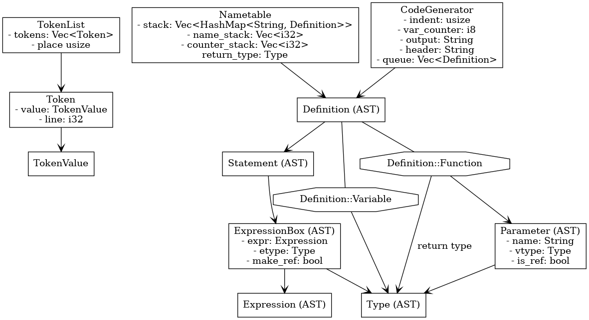

======================
 Mini-Pascal Compiler
======================

Iikka Hauhio,
Code Generation Spring 2018

.. sectnum::

.. contents:: Table of Contents
   :backlinks: none

Building and usage
==================

Assuming that Rust and Cargo are installed::

	cargo run ex/average.pas >average.c

It is also possible to use the precompiled Linux binary::

	bin/mp ex/average.pas >average.c

Tests
-----

Tests are located in the ``test`` directory.
Tests can be run with the following commands::

	cd test
	./test-arrays.sh
	./test-control-structures.sh
	./test-functions.sh
	./test-semantic-errors.sh

Introduction
============

This project is a Mini-Pascal Compiler (MPC).
It implements Mini-Pascal Spring 2018 as specified in https://www.cs.helsinki.fi/u/vihavain/k18/Code%20Generation/Mini-Pascal%20Syntax%202018.pdf
and https://www.cs.helsinki.fi/u/vihavain/k18/Code%20Generation/Code_Gen_Project_2018_Spring.pdf.
In order to make implementing the language easier, the compiler actually implements a superset of the given language.
The superset includes local functions and other features.
The compiler will output a warning if the input program uses them.

The main components of the compiler are the scanner, the parser, the analyser and the code generator.
The following chapters will describe these components.



	A diagram that contains the most important structs and enums of the compiler.
	Unfortunately it isn't UML. I don't know how I should have marked Rust enums in UML.
	In this picture, an arrow means "contains".

Lexical grammar
===============

::

	identifier = ([:alpha:]|_)+
	long_operator = ([:=<>]+|)
	real = [0-9]+\.[0-9]+(e[0-9]+)?
	integer = [0-9]+
	string = "(\\.|.)*"
	comment = \{\*.*\*\}
	whitespace = \s+

	# all characters that do not match the above classes are short operators
	short_operator = .

The scanner scans tokens by matching the begining of the stream with the rules above, in that order.
For simplicitys sake, keywords have the same token class as identifiers.

Strings can contain escape codes that have form ``\.``, where ``.`` is any token.
Three escape codes have a special meaning: ``\\`` becomes ``\``, ``\"`` becomes ``"`` and ``\n`` becomes a newline.
All other escape codes become the character after the backslash.

The comment will end at the first ``*}``.

Lexical errors
--------------

The lexer can panic with one of the following errors:

* Expected a real number literal (there are no digits after ``.``)
* Expected an exponent literal (there are no digits or signs after ``e``)
* Expected an integer literal (the exponent is malformed)
* Unclosed string
* Ungrammatical comment (``{`` is not followed by ``*``)
* Unclosed comment

Syntax and AST
==============

As the MPC actually implements a superset of Mini-Pascal Spring 2018, the syntax is different from the specification.
Specifically:

* There is no distinction between the top level block, function bodies or local blocks. It is possible to define variables and functions in all of them, and use other statements.
* Function body can be any statement, not just a block.
* Assignment is an expression, not a statement.
* Arrays can contain arrays. This feature is not fully supported. For example, it is not possible to index a variable twice, instead a temporary variable must be used.
* Call statement is replaced with a more general expression statement.
* There are several additional builtin functions for allocating arrays and making type casts.

::

	PROGRAM ::= "program" IDENTIFIER ";" BLOCK "."
	
	BLOCK ::= STATEMENT (";" STATEMENT)* ";"?
	
	STATEMENT ::= DEFINITION
	            | "begin" BLOCK "end"
	            | "return" EXPRESSION?
	            | "if" EXPRESSION "then" STATEMENT ("else" STATEMENT)?
	            | "while" EXPRESSION "do" STATEMENT
	            | EXPRESSION
	
	DEFINITION ::= "procedure" IDENTIFIER
	                 "(" (PARAMETER ("," PARAMETER)*)? ")"
	                 ";" STATEMENT
	             | "function" IDENTIFIER
	                 "(" (PARAMETER ("," PARAMETER)*)? ")" ":" TYPE
	                 ";" STATEMENT
	             | "var" IDENTIFIER ("," IDENTIFIER)* ":" TYPE
	
	PARAMETER ::= "var"? IDENTIFIER ":" TYPE
	
	TYPE ::= "integer"
	       | "real"
	       | "string"
	       | "array" ("[" INTEGER-TOKEN "]")? "of" TYPE
	
	EXPRESSION ::= SIMPLE-EXPR (RELATIONAL-OPERATOR SIMPLE-EXPR)*
	SIMPLE-EXPR ::= TERM (ADDITION-OPERATOR TERM)*
	TERM ::= FACTOR (MULTIPLICATION-OPERATOR FACTOR)*
	FACTOR ::= PRIMARY-EXPR ("." "size")?
	PRIMARY-EXPR ::= "(" EXPRESSION ")"
	               | UNARY-OPERATOR FACTOR
	               | IDENTIFIER
	                   (
	                       "[" EXPRESSION "]"
	                   |   "(" (EXPRESSION ("," EXPRESSION)*)? ")"
	                   )?
	                   (":=" EXPRESSION)?
	               | INTEGER-TOKEN
	               | REAL-TOKEN
	               | STRING-TOKEN
	
	RELATIONAL-OPERATOR ::= "=" | "<>" | "<" | ">" | "<=" | ">="
	ADDITION-OPERATOR ::= "+" | "-" | "or"
	MULTIPLICATION-OPERATOR ::= "*" | "/" | "%" | "and"
	UNARY-OPERATOR ::= "+" | "-" | "not"

The parser uses lookahead. It does not backtrack and parses in linear time.

During the parsing an abstract syntax tree (AST) is generated.
It is made of Rust enums. It is possible to think an enum as a C union.
It is a class that can have several different forms, each having different fields.

Below are simplified version of the enums used in the compiler. (For exact version, see line 286 of main.rs).

::

	Type { Boolean, Integer, Real, String, Array(Type, int), Void, Error }
	
	Definition { Function(String, Parameter[], Type, Statement),
	             Variable(Parameter) }
	
	Parameter { String name, Type type, boolean is_ref }
	
	Statement { Definition(Definition),
	            SimpleReturn, Return(ExpressionBox),
	            IfElse(ExpressionBox, Statement, Statement),
	            While(ExpressionBox, Statement),
	            Block(Statement[]),
	            Expression(ExpressionBox), Nop }
	
	ExpressionBox { Expression expr, Type type, boolean make_ref }
	Expression { Integer(int), Real(float), String(String),
	             Assign(ExpressionBox, ExpressionBox),
                     BiOperator(BinaryOperator, ExpressionBox, ExpressionBox),
                     UnOperator(UnaryOperator, ExpressionBox),
                     Call(String, String, ExpressionBox[]),
                     Index(String, ExpressionBox),
                     Variable(String, boolean) }
        
        BinaryOperator { Eq, Neq, Lt, Leq, Gt, Geq,
                         Add, Sub, Mul, Div, Mod, And, Or }
        UnaryOperator { Plus, Minus, Not, Size }

``Parameter`` and ``ExpressionBox`` are not enums but structs.
All enums have a list of forms (constructors), which contain a name and a list of types they contain.

Things to note:

* A variable declaration with multiple variables is expanded to multiple statements.
* ``ExpressionBox`` is a wrapper type that contains fields that all expression share, namely the type and a boolean that tells if the expression should be made a reference (see semantics chapter).
* There is no separate If and If-Else. An If without an Else is an If-Else where the Else block is a nop.
* Assignment is an expression, and its left side is also an expression. The parser ensures that the left side is either a variable, an array subscript or a function call. During the semantic analysis an error is given if it was a function call.
* There are both ``SimpleReturn`` (for procedures) and ``Return`` (for functions).
* Calls have two string fields. The first is the name of the function in the Mini-Pascal source code. The second is initialized during the semantic analysis to be the name of the C function the function was compiled to.
* Variables have a boolean field that is initially false and is changed to true during semantic analysis if the variable is a reference (var parameter).

Semantic analysis
=================

During the semantic analysis, the AST is recursively iterated and each ExpressionBox is annotated with a type and other information.
This is achieved by creating a symbol table during the analysis.

The semantic analysis of a block contains multiple passes.
For each block, in the first pass all function and procedure definitions are searched and appended to the symbol table.
In the second pass, all statements are analysed fully.

In addition to a type, each expression is annotated with information regarding its status as a reference.
If the expression happens to be an argument corresponding to a var parameter, its ``make_ref`` value is set to true.
This is used later during the code generation phase.

Semantic checks
---------------

The MPC has the following semantic checks:

* Symbol is found in the symbol table.
* Keywords are not used as identifiers. (*)
* Functions and procedures are declared at the top level only. (*)
* There are only definitions and blocks at the top level. (*)
* There is only one block at the top level. (*)
* The last statement at the top level is a block. (*)
* Expression statements are either calls or assignments. (*)
* Function returns a value of the correct type.
* The condition of if statement is a boolean expression.
* The condition of while statement is a boolean expression.
* The operands of binary operator expression have the same type.
* The operands of binary operator expression have a correct type (integer, real or boolean depending on the operator).
* The operand of unary operator expression has a correct type (integer, real, boolean or array depending on the operator).
* Symbols used like variables are variables, not functions or procedures.
* The type of an indexed expression is an array.
* Only integers are used as indices.
* The lval and rval of assignment have the same type.
* Function and procedure call arguments have correct types.
* Arguments corresponding to var parameters are either variables or array subscripts.
* Function and procedure calls have the correct number of arguments.
* Function or procedure name in a call corresponds to a function or procedure, not to a variable.

Checks marked with (*) generate warnings.
They check that the program does not use features of MPC that are extensions to the Mini-Pascal Spring 2018 definition,
like local functions and procedures.

Procedure and function calls
----------------------------

For each function and procedure in AST, the name of the function is changed to be the mangled version that will be the name of the C function.
For each function and procedure call, the mangled name is inserted into the second string field (see the AST in previous chapter).

If the called procedure or function is local (defined inside a ``begin..end`` block),
the variables in its block will be added to its parameter list as var parameters (AST is modified).
Consequently, when a local procedure or function is called, the variables will be added as arguments to the function.

Shortcomings
------------

The following semantics are **not** included, although they should be:

* Assignment is used only at the statement level and not as an expression. (*)
* Array types do not contain arrays. (*)

Due to a bug, the case where a function has been given too few arguments is handled incorrectly.
In this situation, a wrong error message is given or, in the worst case, no error message is given and the program compiles succesfully.

Code generation
===============

Statement generation
--------------------

Control statements
``````````````````

Control statements are generated with gotos.

For example,

.. code:: pascal

	var i : integer;
	i := 0;
	while i < 10 do begin
	    writeln(i);
	    i := i + 1
	end;

is compiled to:

.. code:: c

	int _i;
	_i = 0;
	tmp1:;
	char tmp3 = _i < 10;
	if (!tmp3) goto tmp2;
	{
	 printf("%d\n", _i);
	 int tmp4 = _i + 1;
	 _i = tmp4;
	}
	goto tmp1;
	tmp2:;

Blocks
``````

Blocks are compiled to C blocks.
This has no effect, but makes the code look nicer.

Expression statements
`````````````````````

The expression is compiled normally, and the resulting temporary variable is not used.

Expression generation
---------------------

Generally, during the code generation the AST is recursively iterated.
For each expression, a C statement is created that performs the calculation and assigns the answer to a new temporary variable.

For example,

.. code:: pascal

	var i : integer;
	i := (1 + 2) * (3 + 4);

is compiled to:

.. code:: c

	int _i;
	int tmp2 = 1 + 2;
	int tmp3 = 3 + 4;
	int tmp1 = tmp2 * tmp3;
	_i = tmp1;

For some types of expression, a temporary variable is not created. These are:

* Number and string literals
* Variables
* Array indexing (see above shortcomings)

Array index compatibility
`````````````````````````

For each array subscript, an assert call is generated that checks that the index is within bounds.

For example,

.. code:: pascal

	writeln(a[i])

is compiled to:

.. code:: c

	assert(0 <= _i && _i < array_len(_a));
	printf("%d\n", _a[_i]);

References
``````````

Normally, when a var parameter is used, it is dereferenced.
However, when a function or procedure call is generated, the arguments that correspond to var parameters (that have ``make_ref==true``) are referenced.
This means that normal variables and array subscripts are prefixed with ``&`` and var parameters are used without ``*``.

For example, when ``i`` is a normal variable, ``x`` is a var parameter, ``a`` is an array and all parameters of ``f`` are var parameters,

.. code:: pascal

	f(i, x, a[0])

is compiled to:

.. code:: c

	f_1_1(&_i, _x, &_a[0]);

Errors
``````

A semantic errors causes the type of the expression to be ``Error``.
The error type is compatible with all types and does not cause any type errors.

Shortcomings
------------

Target code problems
````````````````````

The MPC generates simplified C code.
However, some restrictions mentioned in the project assignment are broken.

1. Parentheses are used in:

   * Type casts ``(type)(expression)``
   * Unary operator expressions: ``operator(expression)``. This is because the ``array_len`` (``.size``) operator is defined as a C macro and therefore needs parentheses.
   * Macros that are used to implement some features. Macros do not even try to be simplified C. 

2. Array indexing, variable referencing and dereferencing are used like they were simple variables.
   For example, if ``a`` is an integer var parameter, ``a := a + b`` is compiled to:
	
   .. code:: c
	
   	int tmp1 = *_a + _b;
   	*_a = tmp1;
   
   Similarly, ``a[1] := a[1] + b`` is compiled to:
	
   .. code:: c
	
   	int tmp1 = _a[1] + _b;
   	_a[1] = tmp1;
   
   Indexing, referencing and dereferencing was left as it is due to ease of implementation and because there was not enough time to do the implementation as specified.

Name mangling problems
``````````````````````

Variable names are mangled by prefixing them with ``_``.
Collisions shouldn't be a problem in most cases as all variables will be generated as local C variables.

Function name collisions, however, could be a problem.
They are mangled by appending a scope identifier at the end of the name.
In certain cases, when creating functions inside blocks (which is possible but not allowed by Mini-Pascal Spring 2018 specification),
it is possible to create two functions with the same name.

Errors
======

Errors are divided to lexical errors, syntax errors, semantic errors and semantic warnings.
There is no error handling for lexical errors and syntax errors.
All these errors are fatal and cause the program to immediately stop.

Semantic errors are printed one by one.
The AST does not contain line number information, so no location is printed with the errors.

Implementation choices
======================

In addition to the fact that this MPC implements a super set of Mini-Pascal Spring 2018,
several other implementation-level decisions have been made where the language specification was ambigious.

* Integers and reals have C types ``int`` and ``float`` respectively. Their exact size is unknown to the MPC.
* Variables are uninitialized. Using an uninitialized variable results in undefined behaviour as in C.
* It is not possible to allocate an array with a size that is not known compile-time. However, functions were added that can be used to allocate such arrays.
* Arrays are allocated in heap and they are not deallocated in any case.
* There are no automatic type casts. (It is not allowed to eg. add an integer to a real.) It is mandatory to use ``integer_to_real`` and ``real_to_integer`` functions to convert values from type to another.
* Strings are only tokens that are case sensitive. All other tokens can be written either in upper, lower or mixed case.

Missing features
================

In addition to shortcomings listed in other chapters, this MPC does not allow string concatenation with the ``+`` operator.

Builtin functions
=================

**read(vars...)** takes variable number of arguments (that should be either variables or array subscripts).
It will read a value from the standard input for each variable. The value is converted to the type of the variable.
Only integer, real and string variables are supported.

**writeln(vals...)** takes variable number of integer, real or string arguments.
It will print them separated with spaces and followed by a newline.

**integer_to_real(val)** converts an integer to a real.

**real_to_integer(val)** converts a real to an integer, rounding when necessary.

**make_boolean_array(size)** allocates a new boolean array with the given size.

**make_integer_array(size)** allocates a new integer array with the given size.

**make_real_array(size)** allocates a new real array with the given size.

**make_string_array(size)** allocates a new string array with the given size.

Tests
=====

Tests are located in the ``test`` directory.
Tests can be run with the following commands::

	cd test
	./test-arrays.sh
	./test-control-structures.sh
	./test-functions.sh
	./test-semantic-errors.sh

Compiling tests
---------------

Tests are contained in ``.test`` files.
Each such file contains one test per line.
A test has a Mini-Pascal program and the desired output, separated by a ``|`` character.

``.test`` files must be compiled using ``make_tests.röd``::

	röda make_tests.röd output arrays.test
	röda make_tests.röd output control-structures.test
	röda make_tests.röd output functions.test
	röda make_tests.röd errors semantic-errors.test

``output`` tells the script that the desired output will be in the standard output of the compiled Mini-Pascal program.
``errors`` tells the script that the desired output will be in the standard error of the compiler.

The Röda script makes a shell script and a directory, that contains each test program and desired output.
